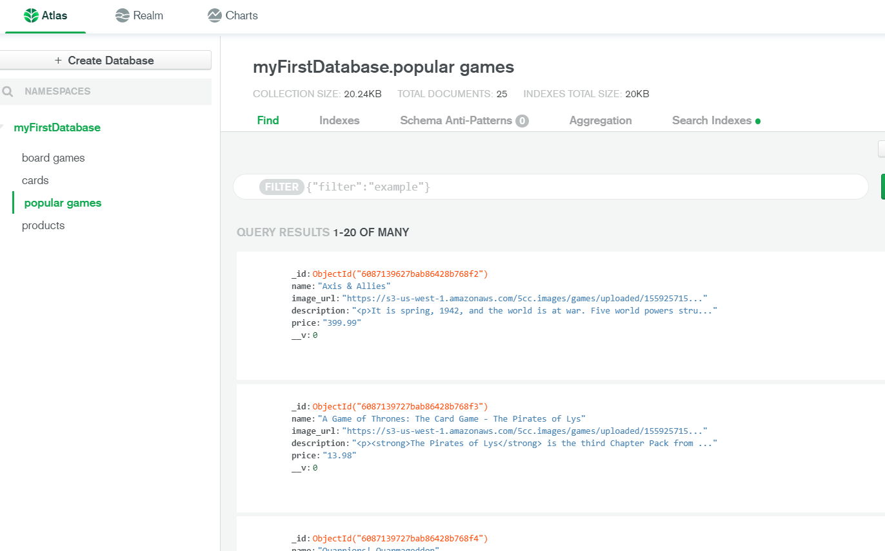

# Welcome to my Github Repo for a Full Stack React-Node App!


## Here are instructions to view this project in your local browser once you download it from GitHub:

1. Clone the repo


### Run these package.json scripts in your terminal from the root folder in this order:

2. npm install 
3. npm run launch 
4. npm run migrate 
5. npm run seed
6. npm run seed:game 
7. npm run start-dev


## Additional Notes: 
1. The Game API does not require an API Key 
2. Popular Games page serves my mongodb datastore with at least 25 items from the seed script
3. Card Games page serves my graphql datastore with at least 25 items from the seed:game script
    * You'll need to refresh your browser every time you Create, Read, Update, and Delete a card game in the Card Games page


## Effectively use conditional logic, JavaScript array methods, and front-end framework elements to render large lists on the web client.

1. This react-node full stack app operates the CRUD (Create-Read-Update-Delete) formula using a board games API and MongoDB and GraphQL servers to render large lists of data on the web client. Here is sample code from the react side to display how I render a large list: 

```<Container className="popular-game-container">
    {gameData.map((game) => {
     return (
    <Card className="popular-game-card" key={game._id}>
    <Link href={game.url} className="gameLink">
     <CardMedia 
     className="GameMedia"
     component="img"
     alt={'Board Game'}
     image={game.image_url}
     card={game.game}
     />
     <CardContent>
     <Typography className="gameName">{game.name}</Typography>
     <Typography className="gamePrice">${game.price}</Typography>
    <div className="icons">
     <IconButton className="gameIcon" aria-label='edit' onClick={() => handleClickEditOpen({ game })}> <EditIcon/></IconButton>
     <IconButton className="gameIcon" aria-label='delete' onClick={() => handleClickDeleteOpen({ game })}><DeleteIcon/></IconButton>
     </div>
     </CardContent>
     </Link>
     </Card>
    
    )
    
     })}
     </Container>
```


## Work with the proper libraries (e.g. VueJS, React) to create and manage the front-end portion of your project using a real development toolset.

1. This app uses React.JS for its front-end framework

## Work with NPM and NodeJS to create and manage the back-end portion of your project.

1. This app uses NPM and NodeJS to manage its back-end portion of the project

## "Seed" script provides way to populate the datastore after the Docker install and launch.

1. Run npm run seed in your terminal to add data to my mongoDB database
2. Run npm run seed:game in your terminal to add data to docker graphql container

## Properly use Git for your source version control with an established record of at least 4 days of commits each week from February 19th through April 30th.

1. Check out my github main page to see all of my commits between February 19th and April 30th found with this link here: 

[Aubrey Jones Github Commits](https://github.com/aubreyjonescreatives)

## Present a User Interface route or "page" that allows the user to CRUD from a MongoDB Datastore: 
1. Check out my MongoDB datastore User Interface route with the Popular Games link in the browser. Here is example code about how I route to my User Interfaces:
   

```function App() {
 
  return (
   <Router>
       <TopNavigation/>
       <Route path='/' exact component={Welcome}/>
     <Route path='/populargame' exact component={PopularGames}/>
     <Route path='/cardgames' exact component={CardGames}/>
   </Router>

  )

}

export default App;   
```


2. CREATE a meaningful (at least 5 data fields) resource through a REST endpoint that is stored in the datastore

```

export const postaddGame = ((req, res) => {

const game = new PopularGame({
    id: req.body.id,
    name: req.body.name, 
    image_url: req.body.image_url, 
    description: req.body.description, 
    price: req.body.price 
})
console.log(game)
game.save() //save method is provided by Mongoose
res.json(game)


})


```


3. Read or GET meaningful data from 3 different REST endpoints

```


export const getAllGames = ((req, res) => {
    PopularGame.find()
    .then(games => {
        res.json(games)
    })
    .catch(err => console.log(err))
})

export const getGames = async (req, res) => {
    const games = await PopularGame.find()
    if (!games) {
        return res.status(400).json({Message: `No games found`})
    }
    res.json(games)
}

export const getGameById = async (req, res) => {
    const gameId = req.body.gameId
    console.log(gameId)
    try{
    const game = await PopularGame.findById(gameId)
    if (!game) {
        return res.status(404).json({Message: 'Game Not Found'})
    }
    res.json(game)
} catch(err) {
    res.status(400).json({Message: `Invalid ID: ${err}`})
}
}


```


4. UPDATE at least 1 portion of meaningful data through the appropriate endpoint

```


export const putEditGame = async (req, res) => {
    const gameId = req.body.GameId
    const updatedObj = {
        name: req.body.data.name,
        image_url: req.body.data.image_url, 
        description: req.body.data.description, 
        price: req.body.data.price 
    } 
    try {
    const game = await PopularGame.findByIdAndUpdate(gameId, updatedObj, {new: true})
    console.log(`Updated the product ${game}`)   
    res.status(200).json(game)
    } catch(err) {
        res.status(400).json({Message: `Could not update: ${err}`})
    }


}


```


5. DELETE some resource via the proper endpoint


```

export const deleteGame = async (req, res) => {
    const gameId = req.body.gameId
    console.log(gameId)
    try {
        const deletedGame = await PopularGame.findByIdAndRemove(gameId)
            if (!deletedGame) {
               return res.status(400).json({Message: `Game to Delete Not Found.`})
            }
            console.log(`Deleted the product ${deletedGame}`)
            res.sendStatus(200)
        } catch (err) {
            res.status(400).json({Message: `Invalid ID: ${err}`})
        }

    }
    


```


## Present a separate User Interface route or "page" that allows the user to CRUD from a Graphql datastore:
1. Check out my Graphql datastore User Interface route with the Card Games link in the browser


## CREATE a meaningful (at least 5 data fields) resource through a GraphQL endpoint that is stored in the datastore

```

const Mutation = objectType({
    name: 'Mutation',
    definition(t) {
       t.nonNull.field('CreateGamer', {
        type: 'Gamer',
        args: {
          data: nonNull(
            arg({
              type: 'GamerCreateInput',
            }),
          ),
        },
        resolve: (_, args, context) => {
          return context.prisma.gamer.create({
            data: {
              gamer: args.data.gamer,
              email: args.data.email,
            },
          })
        },
      }) 
  
      t.field('createGame', {
        type: 'Game',
        args: {
          data: nonNull(
            arg({
              type: 'GameCreateInput',
            }),
          ),
        },
        resolve: (_, args, context) => {
          return context.prisma.game.create({
            data: {
              title: args.data.title,
              description: args.data.description,
              image: args.data.image,
              price: args.data.price,
              link: args.data.link, 
              gameformat: args.data.gameformat
            },
          })
        },
      })
  


```


2. Read or GET meaningful data from with at least 3 different query options from the GraphQL endpoint.

```

const Query = objectType({
    name: 'Query',
    definition(t) {
      t.nonNull.list.nonNull.field('allGamers', {
        type: 'Gamer',
        resolve: (_parent, _args, context) => {
          return context.prisma.gamer.findMany()
        },
      })

      t.nonNull.list.nonNull.field('allGames', {
        type: 'Game',
        resolve: (_parent, _args, context) => {
          return context.prisma.game.findMany()
        },
      })
  
      t.nullable.field('gameById', {
        type: 'Game',
        args: {
          id: intArg(),
        },
        resolve: (_parent, args, context) => {
          return context.prisma.game.findUnique({
            where: { id: args.id || undefined },
          })
        },
      })


```


```


const ALL_GAMES = gql`
query {
    allGames {
        id 
        title
        description 
        image
        price
      
    }
}
`


```


3. UPDATE at least 1 portion of meaningful data through an appropriate GraphQL mutation.

```


   t.field('updateGame', {
        type: 'Game',
        args: {
          id: nonNull(intArg()),
          data: nonNull(
            arg({
              type: 'GameCreateInput',
            }),
          ),
        },
        resolve: (_, args, context) => {
          return context.prisma.game.update({
            where: { id: args.id || undefined },
            data: {
             title: args.data.title, 
             description: args.data.description, 
             defaultCredits: args.data.defaultCredits, 
             image: args.data.image, 
             price: args.data.price, 
             link: args.data.link, 
             gameformat: args.data.gameformat
            
            },
          })
        },
      })
   


```


```

const UPDATE_GAME = gql`
mutation updateGame ($id: Int!, $title: String!, $description: String, $image: String!, $price: String!) {
    updateGame (id: $id, 
        data: {
            title: $title, 
            description: $description
            image: $image 
            price: $price
            
        }) {
            id
           
        }
}
`


```


4. DELETE some resource using a proper GraphQL mutation.

```

  t.field('deleteGame', {
        type: 'Game',
        args: {
          id: nonNull(intArg()),
        },
        resolve: (_, args, context) => {
          return context.prisma.game.delete({
            where: { id: args.id },
          })
        },
      })
    },
  })
   


```


```

const DELETE_GAME = gql`
mutation deleteGame ($id: Int!) {
    deleteGame (id: $id) {
        id
    }
}
`


```


## You will submit the GitHub URL for your project with a detailed ReadMe explaining how to install and run your server(s) on Docker or from your deployed sites.


## Here are instructions to view this project in your local browser once you download it from GitHub:

1. Clone the repo


### Run these package.json scripts in your terminal from the root folder in this order: 

2. npm install 
3. npm run launch 
4. npm run migrate 
5. npm run seed
6. npm run seed:game 
7. npm run start-dev


## Additional Notes: 
1. The Game API does not require an API Key 
2. Popular Games page serves my mongodb datastore 
3. Card Games page serves my graphql datastore
    3. You'll need to refresh your browser every time you send a request to Create, Read, Update, and Delete a card game


## Mongoose as your data modeling tool


## Cloud-based MongoDB as your data store




